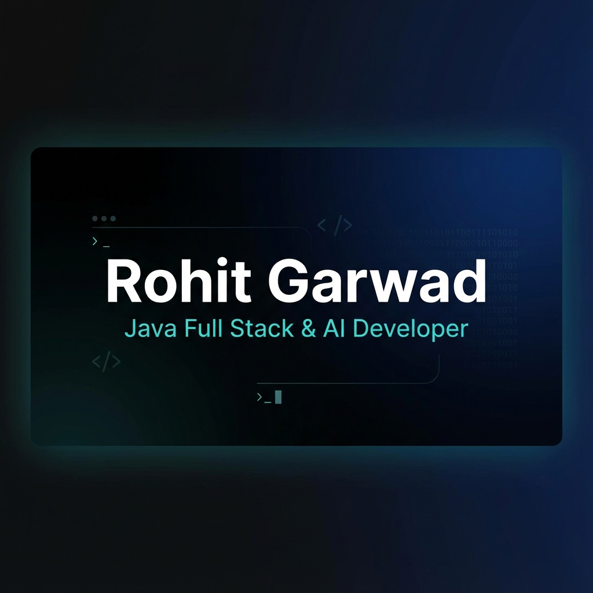

# Rohit Garwad - Portfolio

A modern, responsive portfolio website built with Next.js 15, featuring AI/GenAI expertise showcase, interactive animations, and a premium design aesthetic.



## 🌐 Live Demo

**[rohitgarwad.vercel.app](https://rohitgarwad.vercel.app)**

## ✨ Features

- **Modern Stack**: Next.js 15, React 19, TypeScript, TailwindCSS v4
- **Responsive Design**: Optimized for all devices
- **Dark/Light Mode**: Theme toggle with system preference detection
- **Interactive UI**: Framer Motion animations, 3D card effects
- **Achievements Carousel**: Touch-enabled swipe navigation
- **Contact Form**: Formspree integration with validation
- **SEO Optimized**: Open Graph, Twitter Cards, JSON-LD structured data
- **Performance**: Lighthouse optimized, image optimization

## 🛠️ Tech Stack

| Category | Technologies |
|----------|-------------|
| **Framework** | Next.js 15 (App Router) |
| **Styling** | TailwindCSS v4, CSS Variables |
| **Animation** | Framer Motion |
| **Icons** | Lucide React |
| **Forms** | Formspree |
| **Deployment** | Vercel |

## 🚀 Getting Started

```bash
# Install dependencies
npm install

# Run development server
npm run dev

# Build for production
npm run build
```

Open [http://localhost:3000](http://localhost:3000) to view the site.

## 📁 Project Structure

```
├── src/
│   ├── app/           # Next.js app router pages
│   ├── components/    # React components
│   │   ├── layout/    # Header, Footer
│   │   ├── sections/  # Hero, Projects, About, etc.
│   │   └── ui/        # Reusable UI components
│   ├── context/       # Theme context
│   ├── data/          # Static data (projects, skills)
│   └── lib/           # Utility functions
├── public/            # Static assets
└── resume/            # Resume system (MD + HTML)
```

## 📄 Resume System

The portfolio includes a maintainable resume system:
- Edit `resume/resume.md` for content
- Open `resume/resume.html` in Chrome → Print → Save as PDF

## 📬 Contact

- **Email**: rohitgarwad@gmail.com
- **LinkedIn**: [linkedin.com/in/rohit-garwad](https://linkedin.com/in/rohit-garwad)
- **GitHub**: [github.com/rohitgarwad](https://github.com/rohitgarwad)

## 📝 License

MIT License - feel free to use this as inspiration for your own portfolio!
